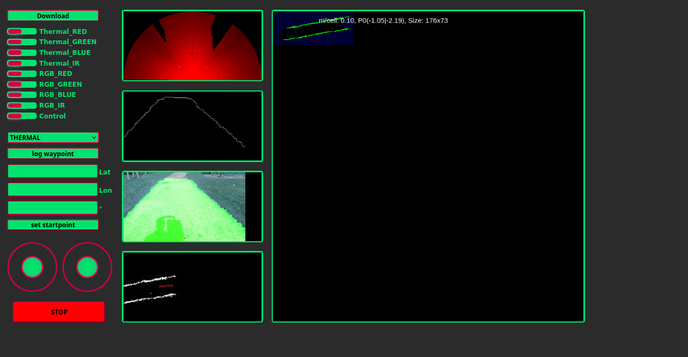

<a href="https://107-systems.org/"></a>
:floppy_disk: `l3xz_frontend`
=============================
[](https://github.com/107-systems/l3xz_frontend/actions/workflows/spell-check.yml)

Web based frontend for the [L3X-Z hexapod robot](https://github.com/107-systems/l3xz).

<p align="center">
  <a href="https://github.com/107-systems/l3xz"></a>
</p>

# Setup

To run the frontend You need a http-Server, e. g. the one included in Python. Also the [rosbridge_server](http://wiki.ros.org/rosbridge_server) package is required to communicate with the ROS-system on the robot.

~~~bash
# Clone this repository with submodules 
git clone --recursive https://github.com/107-systems/l3xz_frontend
# Launch rosbridge socket server
ros2 launch rosbridge_server rosbridge_websocket.launch &
# Start a http server in the webgui folder
cd webgui
python3 -m http.server 8080
~~~

# Pages
## L3X-Z dashboard
<p align="center">
    
</p>
The L3X-Z dashboard page can be used to monitor and operate the exploration of areas.

It has the following features:

* Visualization of multiple sensor messages
* Rendering of a map of the environment
* In time download of sensor data
* Interface for the documentation of selected locations using the recorder node in the [mapping package](https://github.com/107-systems/l3xz-mapping)
* Control of the robot's LEDs
* Optional control of the robot's motion (left joystick: legs, right joystick: sensor head)
* Emergency stop

### Published Topics

TBD

### Subscribed Topics

TBD

### Services

TBD

# Implementation overview

~~~bash
─── webgui                              Root with html and css resources
    ├── javascript                      Javascript root
    │   ├── 3rdparty                    Third party libraries
    │   ├── frontend                    Callbacks for frontend elements
    │   ├── setup                       Setup routines for pages
    │
    ├── l3xz_frontend_base              Submodule with base functionality
    └── resources                       General static resources
~~~

## Adding a new page

To add a new page, a HTML document needs to be created in the root (```webgui```) and linked in ```index.html```. The setup functions, called after loading the static page, are expected to be implemented in ```javascript/setup``` in a new file. The callbacks for static webpage elements should be implemented in a new file in ```javascript/frontend```.
